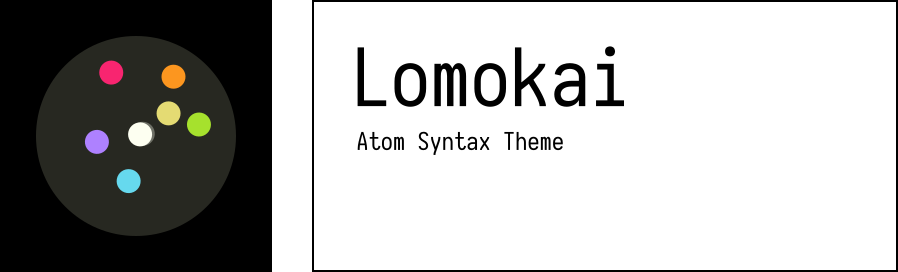

# Lomokai Syntax Theme

A Monokai-based syntax theme with lomographic variations.

## Description

Most of the variations are generated by applying some of HaldCLUTs from [RawTherapee Film Simulation Collection](https://rawpedia.rawtherapee.com/Film_Simulation#RawTherapee_Film_Simulation_Collection) to original Monokai palette. Precoded color schemes similar to Monokai Pro are also included in the package.

A scheme switching menu is available in theme settings, also you can search for `Lomokai Syntax: Select Theme` in quick palette (Cmd+Shift+P or Ctrl+Shift+P) to quickly preview schemes before applying.

## Credits
* Scheme switcher and styles structure are from [Base16 Syntax Theme](https://github.com/Alchiadus/base16-syntax)
* Syntax highlighting definitions are based on the code from [Atom Material Syntax](https://github.com/atom-material/atom-material-syntax)
* Classic Monokai palette and "Pro" variations are based on [Monokai Pro](https://www.monokai.pro)

## Color Schemes Preview

<table>
  <tbody>
  
    <tr>
      
      <td>
        

        
{{ theme.name }}

      </td>
      
    </tr>
  
  </tbody>
</table>
