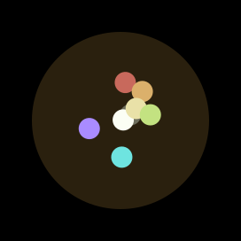
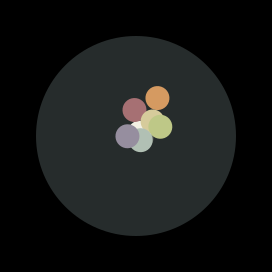
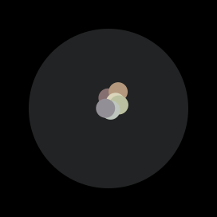
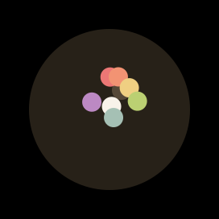
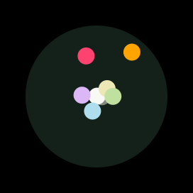

# Lomokai Syntax Theme

A Monokai-based syntax theme with lomographic variations.

## Description

Most of the variations are generated by applying some of HaldCLUTs from [RawTherapee Film Simulation Collection](https://rawpedia.rawtherapee.com/Film_Simulation#RawTherapee_Film_Simulation_Collection) to original Monokai palette. Precoded color schemes similar to Monokai Pro are also included in the package.

A scheme switching menu is available in theme settings, also you can search for `Lomokai Syntax: Select Theme` in quick palette (Cmd+Shift+P or Ctrl+Shift+P) to quickly preview schemes before applying.

## Credits
* Scheme switcher and styles structure are from [Base16 Syntax Theme](https://github.com/Alchiadus/base16-syntax)
* Syntax highlighting definitions are based on the code from [Atom Material Syntax](https://github.com/atom-material/atom-material-syntax)
* Classic Monokai palette and "Pro" variations are based on [Monokai Pro](https://www.monokai.pro)

## Color Schemes Preview

<table>
  <tbody>
  
  <tr>
    
      <td style='padding: 0 0 10px; border: none;'>
      
      
          

          
Lomography X-Pro Slide 200

        </td>
    
      
      <td style='padding: 0 40px 10px; border: none;'>
      
          

          
Agfa Precisa 100

        </td>
    
      
      
      <td style='padding: 0 0 10px; border: none;'>
          

          
Agfa Vista 200

        </td>
    
  </tr>
  
  <tr>
    
      <td style='padding: 0 0 10px; border: none;'>
      
      
          

          
CP Crisp Winter

        </td>
    
      
      <td style='padding: 0 40px 10px; border: none;'>
      
          

          
CP Anime

        </td>
    
      
      
      <td style='padding: 0 0 10px; border: none;'>
          

          
CP Teal Orange 1

        </td>
    
  </tr>
  
  <tr>
    
      <td style='padding: 0 0 10px; border: none;'>
      
      
          

          
CP Futuristic Bleak 1

        </td>
    
      
      <td style='padding: 0 40px 10px; border: none;'>
      
          

          
CP Drop Blues

        </td>
    
      
      
      <td style='padding: 0 0 10px; border: none;'>
          

          
CP Tension Green 4

        </td>
    
  </tr>
  
  <tr>
    
      <td style='padding: 0 0 10px; border: none;'>
      
      
          

          
CP Futuristic Bleak 4

        </td>
    
      
      <td style='padding: 0 40px 10px; border: none;'>
      
          

          
CP Teal Orange 3

        </td>
    
      
      
      <td style='padding: 0 0 10px; border: none;'>
          

          
CP Candle Light

        </td>
    
  </tr>
  
  <tr>
    
      <td style='padding: 0 0 10px; border: none;'>
      
      
          

          
Fuji 800Z 2

        </td>
    
      
      <td style='padding: 0 40px 10px; border: none;'>
      
          

          
Fuji Provia 100F

        </td>
    
      
      
      <td style='padding: 0 0 10px; border: none;'>
          

          
Fuji Astia 100F

        </td>
    
  </tr>
  
  <tr>
    
      <td style='padding: 0 0 10px; border: none;'>
      
      
          

          
Fuji Superia 100 4 ++

        </td>
    
      
      <td style='padding: 0 40px 10px; border: none;'>
      
          

          
Fuji Superia X-Tra 800

        </td>
    
      
      
      <td style='padding: 0 0 10px; border: none;'>
          

          
Fuji Superia 400 3 +

        </td>
    
  </tr>
  
  <tr>
    
      <td style='padding: 0 0 10px; border: none;'>
      
      
          

          
Fuji Superia HG 1600

        </td>
    
      
      <td style='padding: 0 40px 10px; border: none;'>
      
          

          
Fuji FP-100c Negative 3

        </td>
    
      
      
      <td style='padding: 0 0 10px; border: none;'>
          

          
Fuji Sensia 100

        </td>
    
  </tr>
  
  <tr>
    
      <td style='padding: 0 0 10px; border: none;'>
      
      
          

          
Fuji FP-100c Negative 7 +++

        </td>
    
      
      <td style='padding: 0 40px 10px; border: none;'>
      
          

          
Fuji Superia 1600 3 +

        </td>
    
      
      
      <td style='padding: 0 0 10px; border: none;'>
          

          
Fuji FP-100c Negative 5 ++

        </td>
    
  </tr>
  
  <tr>
    
      <td style='padding: 0 0 10px; border: none;'>
      
      
          

          
Fuji FP-100c Negative 6 ++ Alt

        </td>
    
      
      <td style='padding: 0 40px 10px; border: none;'>
      
          

          
Polaroid 690 Cold 5 ++

        </td>
    
      
      
      <td style='padding: 0 0 10px; border: none;'>
          

          
Polaroid Time Zero (Expired) 1 ---

        </td>
    
  </tr>
  
  <tr>
    
      <td style='padding: 0 0 10px; border: none;'>
      
      
          

          
Polaroid 690 4 +

        </td>
    
      
      <td style='padding: 0 40px 10px; border: none;'>
      
          

          
Polaroid PX-680 Cold 1 --

        </td>
    
      
      
      <td style='padding: 0 0 10px; border: none;'>
          

          
Kodak Elite Chrome 400

        </td>
    
  </tr>
  
  <tr>
    
      <td style='padding: 0 0 10px; border: none;'>
      
      
          

          
Kodak Elite Color 400

        </td>
    
      
      <td style='padding: 0 40px 10px; border: none;'>
      
          

          
Kodak Elite Color 200

        </td>
    
      
      
      <td style='padding: 0 0 10px; border: none;'>
          

          
Kodak E-100 GX Ektachrome 100

        </td>
    
  </tr>
  
  <tr>
    
      <td style='padding: 0 0 10px; border: none;'>
      
      
          

          
Kodak Elite 100 XPRO

        </td>
    
      
      <td style='padding: 0 40px 10px; border: none;'>
      
          

          
Kodak Kodachrome 64

        </td>
    
      
      
      <td style='padding: 0 0 10px; border: none;'>
          

          
Kodak Ektachrome 100 VS

        </td>
    
  </tr>
  
  <tr>
    
      <td style='padding: 0 0 10px; border: none;'>
      
      
          

          
Classic

        </td>
    
      
      <td style='padding: 0 40px 10px; border: none;'>
      
          

          
Pro

        </td>
    
      
      
      <td style='padding: 0 0 10px; border: none;'>
          

          
Pro Machine

        </td>
    
  </tr>
  
  <tr>
    
      <td style='padding: 0 0 10px; border: none;'>
      
      
          

          
Pro Octagon

        </td>
    
      
      <td style='padding: 0 40px 10px; border: none;'>
      
          

          
Pro Ristretto

        </td>
    
      
      
      <td style='padding: 0 0 10px; border: none;'>
          

          
Pro Spectrum

        </td>
    
  </tr>
  
  </tbody>
</table>